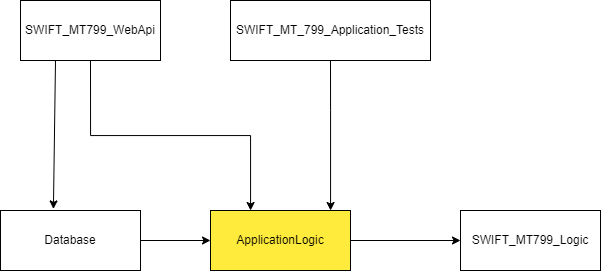

# SWIFT MT799 Web API Documentation

## Overview

The SWIFT MT799 Web API provides endpoints for retrieving and saving SWIFT MT799 messages.

## Table of Contents

- [Overview](#overview)
- [Endpoints](#endpoints)
  - Get Messages from Sender Bank
  - Save Message
- [Instructions for Testing the Project](#instructions-for-testing-the-project)
  - Messages from Bank Code PRCB
  - Messages from Bank Code JJJJ
- [Project Relationships Diagram](#project-relationships-diagram)
- [Database Model](#database-model)

## Endpoints

### 1. **Get Messages from Sender Bank**

**Endpoint:** `/api/get-messages-from-sender/{bankCode}`  
**Method:** `GET`

#### Parameters

- **`bankCode`** (path parameter, required): The code of the bank from which messages are to be retrieved.
  - **Type:** `string`

#### Responses

- **200 OK**
  - **Content Type:**
    - `application/json`
  - **Response Schema:**
    - **Type:** `array`
    - **Items:** [SwiftMT799 Message]

#### Example Request

```http
GET /api/get-messages-from-sender/XXXX
```
### 2. **Save Message**

**Endpoint:** `/api/save`  
**Method:** `POST`

#### Request Body

- **Content Types:**
  - `text/plain`
    
- **Schema:**
  - **Type:** `string`

#### Example Request

```
POST /api/save
Content-Type: text/plain

{1:F01PRCBBGSFAXXX1111111111}{2:O7991111111111ABGRSWACAXXX11111111111111111111N}{4:
:20:67-C111111-KNTRL 
:21:30-111-1111111
:79:NA VNIMANIETO NA: OTDEL BANKOVI GARANTSII
-}{5:{MAC:00000000}{CHK:111111111111}}
```
## Instructions for testing the project.

This section provides sample SWIFT MT799 messages for testing purposes.
Instructions for testing:
1. Run the app.
2. Using Endpoint 2 - **Save Message**, save the following four messages, **each with separate request.**
3. Using Endpoint 1 - **Get Messages from Sender Bank**, retrieve the messages by sender bank.

### Messages from Bank Code PRCB

#### Message 1
```plaintext
{1:F01PRCBBGSFAXXX6666666666}{2:O7996666666666ABGRSWACAXXX66666666666666666666N}{4:
:20:67-C666666-KNTRL 
:21:30-666-6666666
:79:Testing message 5
-}{5:{MAC:00000000}{CHK:666666666666}}
```
#### Message 2
```plaintext
{1:F01PRCBBGSFAXXX1234567890}{2:O7991234567890ABGRSWACAXXX12345678901234567890N}{4:
:20:67-C123456-KNTRL 
:21:30-123-1234567
:79:Testing message 13
-}{5:{MAC:00000000}{CHK:123456789012}}
```

### Messages from Bank Code JJJJ

#### Message 3
```plaintext
{1:F01JJJJBGSFAXXX2222222222}{2:O7992222222222ABGRSWACAXXX22222222222222222222N}{4:
:20:67-C222222-KNTRL 
:21:30-222-2222222
:79:message from bank JJJJ number 1
-}{5:{MAC:00000000}{CHK:222222222222}}
```

#### Message 4
```plaintext
{1:F01JJJJBGSFAXXX4444444444}{2:O7994444444444ABGRSWACAXXX44444444444444444444N}{4:
:20:67-C444444-KNTRL 
:21:30-444-4444444
:79:message from bank JJJJ number 3
-}{5:{MAC:00000000}{CHK:444444444444}}
```
## Project Relationships Diagram

This diagram illustrates the relationships between the different projects in the solution, emphasizing the central role of the `ApplicationLogic` project.



## Database Model

The following section describes the database model for storing SWIFT MT799 messages. All fields in this model are of type `string`.

### Fields

- **`applicationID`**: The identifier for the application.
- **`serviceID`**: The identifier for the service.
- **`senderBankCode`**: The code of the sender bank.
- **`senderCountryCode`**: The country code of the sender.
- **`senderLocationCode`**: The location code of the sender.
- **`senderLogicalTerminal`**: The logical terminal of the sender.
- **`senderSessionNumber`**: The session number of the sender.
- **`senderSequenceNumber`**: The sequence number of the sender.
- **`inputTime`**: The timestamp when the message was input.
- **`receiverBankCode`**: The code of the receiver bank.
- **`receiverCountryCode`**: The country code of the receiver.
- **`receiverLocationCode`**: The location code of the receiver.
- **`receiverLogicalTerminal`**: The logical terminal of the receiver.
- **`receiverBranchCode`**: The branch code of the receiver.
- **`messageInputReference`**: The input reference for the message.
- **`messagePriority`**: The priority level of the message.
- **`transactionReferenceNumber`**: The reference number for the transaction.
- **`relatedReference`**: The reference number related to the transaction.
- **`narrativeText`**: The narrative text included in the message.
- **`messageAuthenticationCode`**: The authentication code for the message.
- **`checksum`**: The checksum for validating the message integrity.
